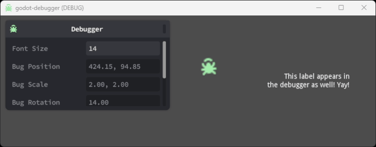

# 🐛 godot-debugger

A plugin for debugging values easily in Godot.



# Installation

Copy the `addons/debugger` into the `addons/` folder of your project

Enable the add-on in Project Settings.

## Usage

Add the  `Debugger` Node to your scene and get a reference to it in your script.  
You can then call the add() method of the debugger to add a label displaying the property of the object:

```
var debugger = get_node("Debugger")

debugger.add(your_object, "property_as_string", "Custom Identifier")
```

For example (see the GIF above):

```
var bug = get_node("Sprite")

debuger.add(bug, "position", "Bug Position")
```
